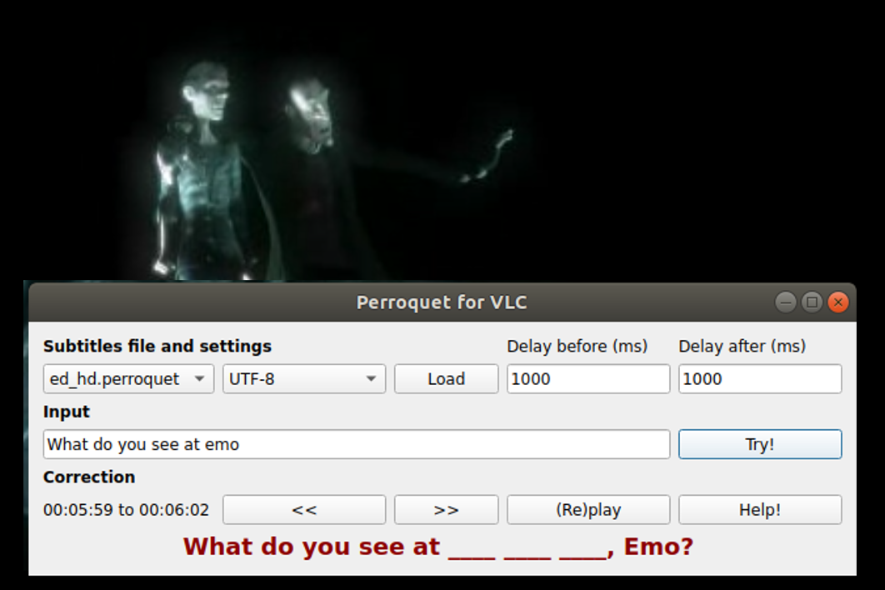

# Perroquet Subtitles for VLC



Pratiquez votre compréhension orale en retranscrivant les sous-titres de vos films favoris (inclut la correction)

- [MISCELLANEOUS](#miscellaneous)

## Présentation

Cette extension Lua pour VLC vous permet de pratiquer votre compréhension orale dans la/les langue(s) que vous apprenez.

A partir d'une copie d'une vidéo ou d'un film en votre possession et accompagné d'un fichier (.srt) de sous-titres synchronisé dans la langue originale (ou dans la même langue que la bande son) :

* Perroquet Subtitles for VLC "découpe" votre film en séquence
* Pour chaque séquence, vous écrivez ce que vous comprenez dans le champs "input"
* Perroquet compare ce que vous avez deviné avec les véritables sous-titres et vous aide a progresser.
* Vous pouvez rejouer les séquences et obtenir de l'aide quand vous êtes bloqués

Améliorez votre compréhension orale et votre orthographe dans de nombreux langages et sur un large panel de fichiers vidéos et audios !

## Premiers pas

### Versions

##### <strong>V1.1
Testé avec:
  * VLC 3.0.14 Vetinari pour Linux Ubuntu 18.04
  * VLC 3.0.16 Vetinari pour Windows</strong>

##### V1.0:
Testé avec:
  * VLC 3.0.8 Vetinari pour Linux Ubuntu 18.04

### Installation

Copier les fichiers <a href=https://github.com/GDoux/Perroquet-Subtitles-for-VLC/blob/main/perroquet.lua> perroquet.lua </a> et <a href=https://github.com/GDoux/Perroquet-Subtitles-for-VLC/blob/main/perroquet_intf.lua> perroquet_intf.lua </a> dans les dossiers suivants (dépend de votre OS) :

* Windows
    * Tous les utilisateurs :
        * perroquet.lua dans	Program Files\VideoLAN\VLC\lua\extensions\
        * perroquet_intf.lua dans	Program Files\VideoLAN\VLC\lua\intf\
    * Utilisateur : [non testé]
        * perroquet.lua dans 	%APPDATA%\vlc\lua\extensions\
        * perroquet_intf.lua dans	%APPDATA%\vlc\lua\extensions\
* Mac OS X [non testé]
    * Tous les utilisateurs :
        * perroquet.lua dans	/Applications/VLC.app/Contents/MacOS/share/lua/extensions/
        * perroquet_intf.lua dans	/Applications/VLC.app/Contents/MacOS/share/lua/intf/
    * Utilisateur :
        * perroquet.lua dans 	/Users/%your_name%/Library/ApplicationSupport/org.videolan.vlc/lua/extensions/
        * perroquet_intf.lua dans	/Users/%your_name%/Library/ApplicationSupport/org.videolan.vlc/lua/intf/
* Linux (il peut être nécessaire de `chmod 755` les fichiers)
    * Tous les utilisateurs :
        * perroquet.lua dans	/usr/lib/vlc/lua/playlist/ or /usr/share/vlc/lua/extensions/
        * perroquet_intf.lua dans	/usr/lib/vlc/lua/playlist/ or /usr/share/vlc/lua/intf/
    * Utilisateur :
        * perroquet.lua in 	~/.local/share/vlc/lua/extensions/
        * perroquet_intf.lua in	~/.local/share/vlc/lua/intf/
    * Snap: (le numéro 2288 peut être différent sur votre machine)
        * perroquet.lua in 	~/snap/vlc/2288/.local/share/vlc/lua/extensions/
        * perroquet_intf.lua in	~/snap/vlc/2288/.local/share/vlc/lua/intf/
		
Ouvrez ensuite VLC et sélectionnez `Perroquet Subtitles for VLC` dans le menu `Vue`. Cliquez sur `SAVE` and rédemarrez VLC.

## Utilisation

#### Préparation
En supposant que le fichier vidéo s'apelle "MOVIE_FILE.avi" (ou .mkv, .mp4, etc.) et que vous disposez d'un fichier de sous-titres synchronisés "SUB_FOR_MOVIE_FILE.srt".
1) Ouvrez VLC et sélectionnez `Perroquet Subtitles for VLC` dans le menu `Vue`. Cliquez sur `SAVE` et redémarrez VLC
2) Renommez "SUB_FOR_MOVIE_FILE.srt" en "MOVIE_FILE.perroquet" ou "MOVIE_FILE[ANY_CHARACTERS].perroquet"
3) Vérifiez que le fichier "MOVIE_FILE.perroquet" se trouve dans le même dossier que "MOVIE_FILE.avi"
4) Assurez-vous qu'aucun fichier .srt ou de sous-titre nommé "MOVIE_FILE[ANY_CHARACTERS].srt" ou similaire ne soit dans le même dossier que le fichier "MOVIE_FILE.avi" (dans le cas contraire, les sous-titres apparaitront dans VLC...)
5) Ouvrez "MOVIE_FILE.avi" dans VLC
6) Dans le menu de VLC, cliquez sur Vue, puis sur Perroquet Subtitles for VLC
7) Une nouvelle fenêtre devrait s'ouvrir

#### Utilisation
Vous devriez alors pouvoir exécutez les actions suivantes
1) Le fichier .perroquet file est chargé par défaut, consultez la section "Aide" si vous rencontrez une erreur ou des problèmes d'encodage de caractères
2) Choisissez une séquence avec VLC ou avec les boutons `<<` / `>>` et cliquez sur `(Re)play`
3) Écrivez ce que vous comprenez  dans le champs Input et cliquez sur le bouton `Try!`
4) Vérifiez dans le champs situé sous le bouton `(Re)play` ce que vous avez trouvé ou raté. Cliquez sur `(Re)play` si vous voulez écouter la séquence a nouveau
5) Quand vous avez correctement reproduit la séquence, VLC rejoue la séquence une dernière fois et poursuit avec la séquence suivante
6) Si vous êtes bloqué, cliquez sur `Help!`

* Remarques: 
    * Les fichiers comme "MOVIE_FILE[ANY_CHARACTERS].perroquet.srt" sont également acceptés mais vous devrez peut-être désactiver les sous-titres dans l'interface de VLC.
 
## Aide

### Remarques générales
* Le programme accepte plusieurs encodages de caractère dans les sous-titres (des fichiers encodés en ISO-8859-1, UTF-8 et UTF-8-SIG ont été testés avec succès)
* Bien que les fichiers de sous-titres correspondent rarement exactement à la bande son, ceux-ci sont dans leur vaste majorité suffisamment proches pour permettre une bonne expérience d'apprentissage. Utilise le bouton `Help` quand vous sentez que vous êtes bloqués
* Les sous-titres pour personnes sourdes et malentendantes sont généralement de très bons fichiers pour pratiquer. Ces derniers peuvent cependant transcrire des sons non verbaux, généralement mis en évidence par des "(...)"

### Fichiers de sous-titres et configurations:
* Si vous avez plusieurs fichiers ".perroquet" files, sélectionnez l'un d'entre eux dans la liste déroulante puis cliquez sur `Load`
* Si vous avez une erreur du type "Malformed subtitle...", essayez de modifier l'encodage par défaut UTF-8 en "UTF-8-SIG" ou "ISO_8859-1-SIG" dans la liste déroulante. Puis cliquez sur `Load`.
* Si vous voyez des caractères mal encodés tels que � or ã, essayez de changer l'encodage par défaut UTF-8 en "ISO_8859-1" dans la liste déroulante. Puis cliquez sur `Load`
* Si la séquence est trop courte ou commence trop tard (et que vous ne pouvez pas entendre la séquence complète), essayez de 
	* Changer les paramètres `Delay before` et `Delay After` (par défaut à 1s) par des valeurs plus grandes
	* Changer manuellement la synchronisation dans VLC avec les touches `g` and `h` dans VLC
	* Resynchroniser votre fichier .srt original avec un outil adéquat.

### Autres
Si vous voulez désactiver l'interface Perroquet_intf, allez dans Outils> Préférences et sélectionnez "Tous" dans `Afficher les paramètres`. Puis allez dans Interface> Interfaces Principales et effacez le champs `Interface Lua`. Enregistrez et redémarrez VLC.

### Débugage

Le programme peut être debugé en démarrant VLC en mode verbose. Sous Linux cela donne:
```sh
vlc --verbose=2
```
Sous windows: ouvrez VLC, puis `ctrl+M` et changez la "verbosity" à 2.

# MISCELLANEOUS

## Author

Gaspard DOUXCHAMPS

## Version History

* 1.1
    * Tested and corrected for Windows
    * Solved the freeze problem
    * Readme in French
    
* 1.0
    * Initial Release tested on linux

* Main possible improvements:
    * Support and test srt file for better compatibility
    * Implement color code when "input" is getting close to "correction"

## License

This project is licensed under the GNU GPL v3 License - see the LICENSE.md file for details

## Acknowledgments

* Inspiration :
    * Perroquet Team and Fred Bertolus for the original software Perroquet (https://launchpad.net/perroquet)

* Code snippet :
    * The `Perroquet.lua` script was adapted from the "Subtitle Word Search" add-on by Tomás Crespo (https://github.com/tcrespog/vlc-subtitle-word-search/)
    * The `Time v3.2` script by Mederi was adapted for the version 1.1 (https://addons.videolan.org/p/1154032/)

* Other:
    * DomPizzie for the Simple README template (https://gist.github.com/DomPizzie/7a5ff55ffa9081f2de27c315f5018afc)
